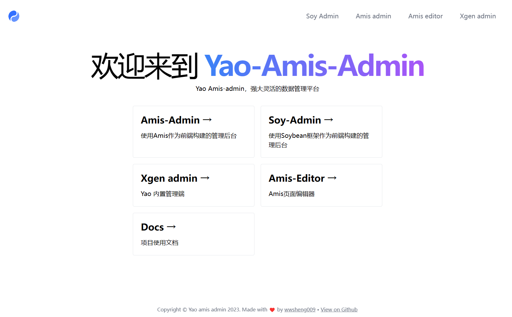
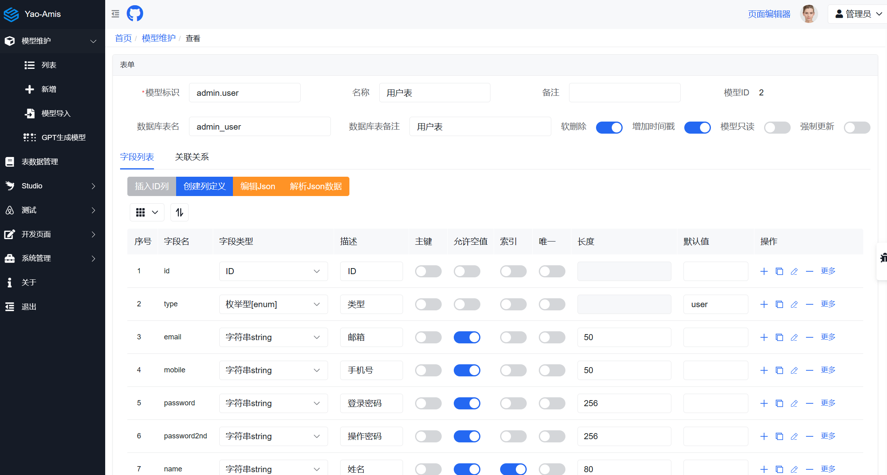
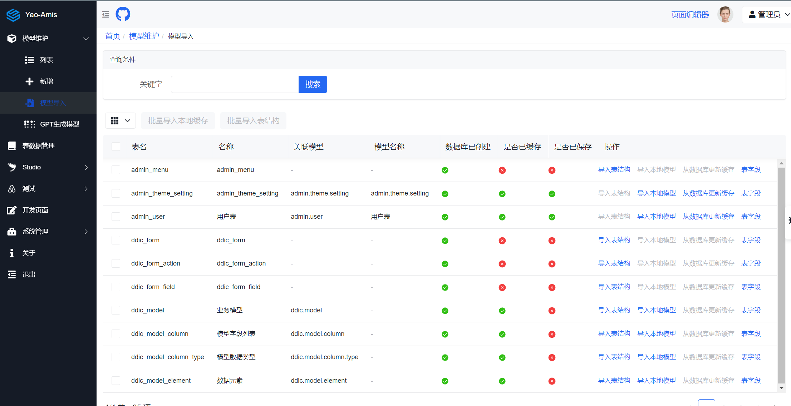
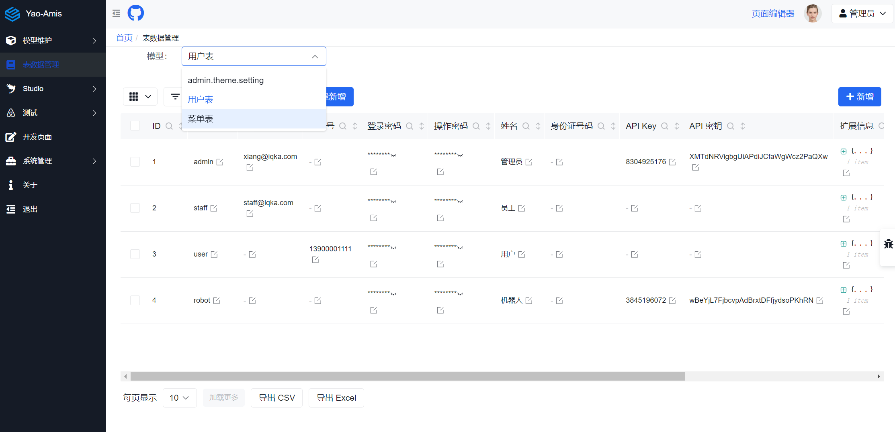
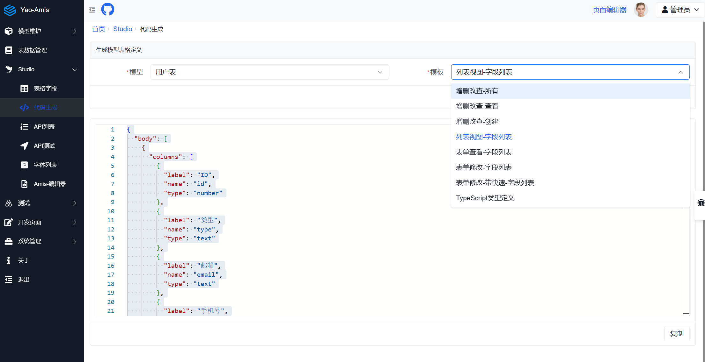
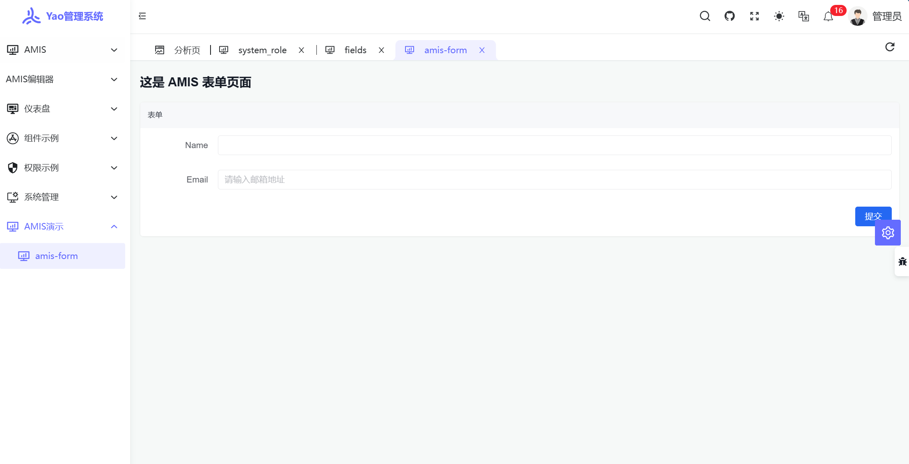
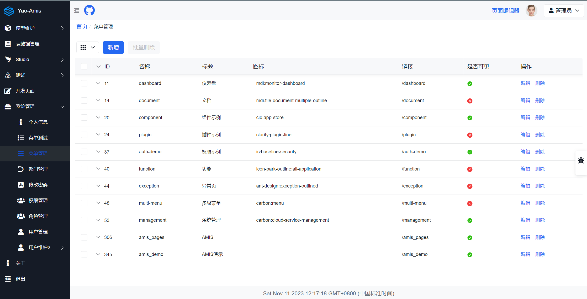
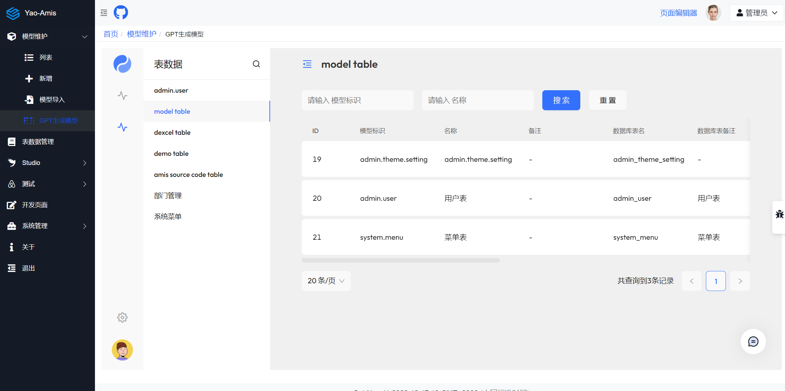

# Yao-amis-admin

## 介绍

本项目的目标是快速开发管理后台项目。

- 使用 Yao项目 作为项目后端的执行引擎。yao引擎提供了丰富的后台功能，但是上手会比较费力，需要手动编写很多的json配置文件。这个项目降低了yao的上手难度，快速的搭建一个数据管理后台。这个平台的使用步骤如下：
    * 系统安装，这个项目已提供了打包好的容器影像。
    * 创建模型，模型是驱动api，后台页面的基础。使用这个平台的第一步是创建业务模型，模型创建可以使用图形化的界面进行操作。
    * 数据维护，当创建好模型后，就可以维护数据，平台会根据模型配置动态生成数据维护界面。
    * 定制开发，当熟悉这个平台或是Yao开发引擎后，可以进行自定义的开发您的API，后台处理接口，增强处理数据插件等等，也可以使用新的前台处理界面，所有一切都可以扩展。

- 使用 amis-sdk 作为项目前端的解决方案，快速的使用 json 配置出 crud 界面。amis 框架是一个前端低代码解决方案，可以通过 json 文件配置出页面,包含表单、表格、图表等丰富组件，amis 可以通过前端图形化配置出页面,同时也支持通过代码配置，管理后台 99%的页面都是使用 amis-json 标准配置。

- 使用 Amis 编辑器作表单配置工具。

- 使用 soybean-admin 作为自定义开发前端的解决方案，把amis-sdk嵌入到页签里。

利用 amis 的前端优势与 yao 的后端优势,我们可以开发出一个页面可随意定制的前后端分离的中后台管理系统。


[更详细的说明与教程](https://wwsheng009.github.io/yao-docs/Admin-App/%E6%95%99%E7%A8%8B/1%E9%A1%B9%E7%9B%AE%E4%BB%8B%E7%BB%8D.html)


## 安装

使用容器运行，已打包编辑器与 soy-admin

```sh
docker run -d -p 5099:5099 wwsheng009/yao-amis-admin-amd64:latest
```
在浏览器里访问地址：http://localhost:5099/，
进行初始化安装，选择数据库的类型并输入数据库的相关信息后确定安装。

管理员用户名：xiang@iqka.com 密码：A123456p+

## 演示地址：

演示地址：[demo](http://fun.wwsheng.online:5099/)，用户名：xiang@iqka.com 密码：A123456p+





## 特性列表

### 基础功能

- 图形化 Yao 模型管理，不需要写代码即可配置出业务数据模型定义。
- 模型 API 自动生成，模型定义后，对应的外部 CRUD 接口直接可用，无须额外配置。
- Amis 页面代码生成，预览，生成标准格式的 amis 页面配置，快速开发 CRUD 页面。
- 集成了 Amis 页面编辑器，在页面编辑器创建页面后管理后台直接可以使用，页面编辑器可直接使用后台的 API，无须额外配置。
- 文件管理，支持个人文件管理，公共文件管理，项目文件管理。非公共文件管理支持权限管控。
- Xgen 登录集成/Amis 页面编辑器集成/Soy-Admin 管理后台集成。
- 菜单管理配置。

### 业务功能

- 支持用户注册/管理，支持用户角色权限配置。
- 动态表数据维护，支持子表，关联表数据显示/维护。
- 开箱即用的博客功能，博客功能支持 MetaWeblog Api，可以使用外部编辑器发布文章到管理后台。
- 支持 Odata 数据读取接口，可以在 excel 中同步模型数据。
- 文件管理支持文档预览。包括 PDF/WORD/EXCEL/PPT/音频/视频。
- 集成了 yao xgen 管理后台，可使用 neo 助手生成代码。

### 功能扩展

- Soybean-Admin Vue 管理后台的集成示例，使用 Vue 进行高级功能扩展，后台提供 soy-admin 菜单管理支持，个人设置支持[soybean-admin-amis-yao](https://github.com/wwsheng009/soybean-admin-amis-yao)
- vscode 页面预览插件[amis-yao-viewer-vscode](https://github.com/wwsheng009/amis-yao-viewer-vscode)
- Amis 页面编辑器[amis-editor-yao](https://github.com/wwsheng009/amis-editor-yao)
- 在 Vscode 中编写博客插件[yao-blog-vscode](https://github.com/wwsheng009/yao-blog-vscode)
- 邮件客户端插件[yao-plugin-email](https://github.com/wwsheng009/yao-plugin-email)
- 系统性能数据收集插件[yao-plugin-psutil](https://github.com/wwsheng009/yao-plugin-psutil)
- Yao-python 插件开发示例[yao-plugin-python](https://github.com/wwsheng009/yao-plugin-python)
- Yao-Rust 插件开发示例[yao-plugin-rust](https://github.com/wwsheng009/yao-plugin-rust)
- Yao-Json-schema[yao-app-ts-types](https://github.com/wwsheng009/yao-app-ts-types)

## 功能介绍

### 模型创建

Yao 模型是整个系统的核心组件，在这里，可以使用界面创建 Yao 的模型定义，也可以导入其它的格式的模型。或是导入数据库表结构作为模型定义。创建模型后，模型对应的 amis 界面定义与操作的 api 接口就会自动的生成。

- 模型创建中支持直接配置文件/图片/视频的类型。
- 模型字段支持配置关联表查询。
- 模型支持模型关联关系配置，一对一/一对多。



### AMIS 界面编辑器集成

实现了 AMIS 界面编辑器的集成，可以直接在编辑器中使用 api 接口读取数据。

### API 接口测试

基于 amis-sdk，实现了在线的 yao api 接口测试功能。


### 表数据维护

基于模型定义，可以推断出整个 crud 界面的定义。在表数据维护的入口可以查看或是更新表数据。



### 代码生成

基于模型定义，也可以自己创建不同的代码生成功能。



### Soybean-admin 集成

amis-sdk 可以与 react 或是 vue 作集成开发，这里是把 amis-sdk 作为 vue 组件，嵌入到第三方的 admin 框架。



已经实现了 soybean 的菜单管理功能。



### yao xgen 集成

yao 本身有一个 xgen 的管理后端，已经实现了 aigc 的功能，这里也是把 xgen 的模型生成功能利用起来。



## 本地安装

下载并安装 Yao 程序：https://github.com/wwsheng009/yao/releases

修改.env 文件中数据库配置

```shell
git clone https://github.com/wwsheng009/yao-amis-admin

cd yao-amis-admin

#如果需要配置默认配置
cp .sqlite.env .env

yao migrate

yao start
```

本应用可以使用三个登录入口，

Yao 本身的 Xgen 登录入口：http://localhost:5099/admin/login/admin

soy-admin 登录入口：http://localhost:5099/soy-admin

默认的登录入中：http://localhost:5099/amis-admin/login.html

登录用户名：xiang@iqka.com
密码：A123456p+

登录成功后会跳转到测试页面，

## 跨域

在使用 amis 编辑器时，编辑器项目一般会放在单独的项目时，这时编辑器访问地址的域名跟 yao 服务器的域名不一样。为了让编辑器可以直接访问 yao api 地址，可以在 yao 项目的.env 文件里配置上参数 YAO_ALLOW_FROM，允许跨域访问。

```sh
YAO_ALLOW_FROM="localhost"。
# 如果多个地址，使用|进行分隔
YAO_ALLOW_FROM="localhost|localhost:5099"。
```
## 项目结构说明

yao引擎内置了js脚本解析功能，专门用于数据处理，所有的js脚本文件保存在目录/scripts/下。

amis相关的页面配置目录保存在目录/data/pages目录下。

其它的目录请参考Yao引擎的文档说明。

## 参考

amis 框架地址:https://github.com/baidu/amis

amis 文档地址：https://aisuda.bce.baidu.com/amis/zh-CN/docs/index

yao 处理器列表：https://yaoapps.com/doc/%E6%89%8B%E5%86%8C/%E5%A4%84%E7%90%86%E5%99%A8/Model

## 许可

MIT
