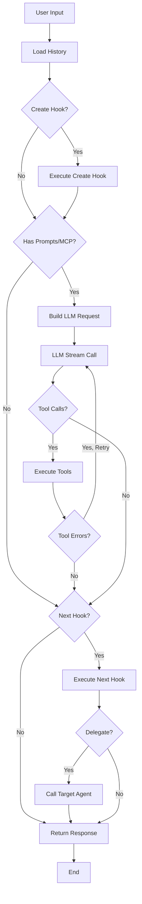

# Yao Agent Hooks Reference

## Overview

Hooks are TypeScript functions that intercept and customize the agent execution flow. There are two hooks: `Create` (before LLM) and `Next` (after LLM).

## Execution Flow

```
User Input → Load History → Create Hook → LLM Call → Tool Execution → Next Hook → Response
```



## Create Hook

Called at the beginning of agent execution, before any LLM call.

### Signature

```typescript
function Create(
  ctx: agent.Context,
  messages: agent.Message[],
  options?: Record<string, any>
): agent.Create | null;
```

### Parameters

- `ctx`: Agent context object with authorized info, memory, trace, mcp
- `messages`: Array of input messages (including history if enabled)
- `options`: Optional call-level options

### Return Value

```typescript
interface HookCreateResponse {
  // Messages to send to LLM (can modify/replace input)
  messages?: Message[];

  // Generation parameters
  temperature?: number;
  max_tokens?: number;
  max_completion_tokens?: number;

  // MCP configuration
  mcp_servers?: MCPServerConfig[];

  // Prompt configuration
  prompt_preset?: string; // e.g., "chat", "task.analysis"
  disable_global_prompts?: boolean;

  // Context overrides
  connector?: string;
  locale?: string;
  theme?: string;
  route?: string;
  metadata?: Record<string, any>;

  // Capability wrappers
  uses?: UsesConfig;
  force_uses?: boolean;

  // Audio output
  audio?: AudioConfig;
}
```

### Example

```typescript
function Create(ctx: agent.Context, messages: agent.Message[]): agent.Create {
  // Store data for Next hook
  ctx.memory.context.Set("start_time", Date.now());

  // Check system readiness
  if (!SystemReady(ctx)) {
    ctx.Send("System not initialized. Running setup...");
    Setup(ctx);
  }

  // Configure based on user intent
  const lastMessage = messages[messages.length - 1]?.content || "";
  const isQuery = lastMessage.toLowerCase().includes("search");

  return {
    messages,
    mcp_servers: [{ server_id: "agents.myassistant.tools" }],
    prompt_preset: isQuery ? "query" : "chat",
    temperature: isQuery ? 0.3 : 0.7,
  };
}
```

## Next Hook

Called after LLM response and tool calls (if any).

### Signature

```typescript
function Next(
  ctx: agent.Context,
  payload: agent.Payload,
  options?: Record<string, any>
): agent.Next | null;
```

### Payload Structure

```typescript
interface NextHookPayload {
  messages: Message[]; // Messages sent to LLM
  completion?: CompletionResponse; // LLM response
  tools?: ToolCallResponse[]; // Tool call results
  error?: string; // Error if LLM failed
}

interface CompletionResponse {
  content: string; // LLM text response
  tool_calls?: ToolCall[]; // Tool calls requested
  usage?: UsageInfo; // Token usage
}

interface ToolCallResponse {
  toolcall_id: string;
  server: string; // MCP server name
  tool: string; // Tool name
  arguments?: any; // Arguments passed
  result?: any; // Execution result
  error?: string; // Error if failed
}
```

### Return Value

```typescript
interface NextHookResponse {
  // Delegate to another agent
  delegate?: {
    agent_id: string;
    messages: Message[];
    options?: Record<string, any>;
  };

  // Custom response data
  data?: any;

  // Metadata for logging
  metadata?: Record<string, any>;
}
```

### Example

```typescript
function Next(ctx: agent.Context, payload: agent.Payload): agent.Next {
  const { completion, tools, error } = payload;

  // Handle errors
  if (error) {
    ctx.Send({
      type: "error",
      props: { message: "An error occurred", error },
    });
    return { data: { status: "error" } };
  }

  // Process tool results
  if (tools && tools.length > 0) {
    for (const tool of tools) {
      if (tool.result?.intent === "query") {
        // Delegate to query agent
        return {
          delegate: {
            agent_id: "query_agent",
            messages: payload.messages,
          },
        };
      }
    }
  }

  // Calculate duration
  const startTime = ctx.memory.context.Get("start_time");
  const duration = Date.now() - startTime;

  // Return custom data
  return {
    data: {
      status: "success",
      duration_ms: duration,
    },
  };
}
```

## Common Patterns

### 1. System Initialization Check

```typescript
function Create(ctx: agent.Context, messages: agent.Message[]): agent.Create {
  if (!SystemReady(ctx)) {
    Setup(ctx);
  }
  return { messages };
}

function SystemReady(ctx: agent.Context): boolean {
  const ownerID = ctx.authorized?.team_id || ctx.authorized?.user_id;
  if (!ownerID) return false;

  // Check database setting
  const records = Process("models.agents.myassistant.setting.Get", {
    wheres: [{ column: "user_id", value: ownerID }],
    limit: 1,
  });

  return Array.isArray(records) && records.length > 0;
}
```

### 2. Intent-Based Routing

```typescript
function Next(ctx: agent.Context, payload: agent.Payload): agent.Next {
  const { tools } = payload;

  if (tools && tools.length > 0) {
    const intent = tools[0]?.result?.intent;

    switch (intent) {
      case "query":
        ctx.space.Set("choose_prompt", "query");
        return {
          delegate: { agent_id: "myassistant", messages: payload.messages },
        };

      case "analysis":
        return {
          delegate: { agent_id: "analysis_agent", messages: payload.messages },
        };
    }
  }

  return null; // Use standard response
}
```

### 3. Streaming Output

```typescript
function Next(ctx: agent.Context, payload: agent.Payload): agent.Next {
  const { tools } = payload;

  if (tools && tools.length > 0) {
    const msg_id = ctx.SendStream("## Processing Results\n\n");

    for (const tool of tools) {
      ctx.Append(msg_id, `**${tool.tool}**: `);
      ctx.Append(msg_id, JSON.stringify(tool.result) + "\n\n");
    }

    ctx.End(msg_id);
  }

  return null;
}
```

### 4. Error Recovery

```typescript
function Next(ctx: agent.Context, payload: agent.Payload): agent.Next {
  const { error, tools } = payload;

  if (error) {
    ctx.trace.Error(error);
    return {
      data: {
        status: "error",
        message: "Request failed",
        recovery: "Please try again",
      },
    };
  }

  // Check for tool errors
  const failedTools = tools?.filter((t) => t.error) || [];
  if (failedTools.length > 0) {
    ctx.trace.Warn(`${failedTools.length} tools failed`);
  }

  return null;
}
```

## Key Points

1. **Hooks are optional** - Agent works without them
2. **Return `null`** to use default behavior
3. **LLM call is optional** - Skipped if no prompts/MCP configured
4. **Use `ctx.memory.context`** to pass data between hooks
5. **Hooks can send messages** via `ctx.Send()`, `ctx.SendStream()`
6. **Delegation** allows chaining agents together

## Best Practices & Common Pitfalls

### ⚠️ Micro-Agent Architecture: One Agent, One Job

**Design Principle**: Adopt a "micro-agent" architecture where each agent focuses on a single responsibility. This makes agents easier to test, maintain, and compose.

```
Main Agent (Router)
├── setup       → System initialization only
├── submission  → Expense submission only
├── query       → Data queries only
└── analysis    → Analytics only
```

### ⚠️ Be Careful When Delegating Back to Main Agent

Sub-agent delegating back to main agent can cause issues if not handled properly:

**When it's problematic**:

- Main agent has initialization checks that redirect to setup agent → causes loops
- Main agent doesn't expect the handover message format

```typescript
// ⚠️ RISKY: May cause loops if main agent redirects
function Next(ctx: agent.Context, payload: agent.Payload): agent.Next {
  if (success) {
    return {
      delegate: {
        agent_id: "expense", // Main agent - be careful!
        messages: [{ role: "user", content: "Done" }],
      },
    };
  }
  return null;
}
```

**When it's acceptable**:

- Main agent explicitly supports handover (checks metadata or message format)
- After completing a task, user needs intent re-recognition for next action
- Main agent's Create hook handles the handover gracefully

```typescript
// ✅ RECOMMENDED: Stay self-contained, return data
function Next(ctx: agent.Context, payload: agent.Payload): agent.Next {
  if (success) {
    ctx.Send("✅ Operation completed! What would you like to do next?");
    return {
      data: { status: "success", result: result },
    };
  }
  return null;
}

// ✅ ACCEPTABLE: Delegate with proper metadata if main agent supports it
function Next(ctx: agent.Context, payload: agent.Payload): agent.Next {
  if (success) {
    ctx.Send("✅ Expense submitted!");
    return {
      delegate: {
        agent_id: "expense",
        messages: [{ role: "user", content: "continue" }],
        options: {
          metadata: { from: "submission", completed: true }, // Signal to main agent
        },
      },
    };
  }
  return null;
}
```

**Best Practice**: Keep sub-agents self-contained. If delegation is needed, ensure the main agent's Create hook explicitly handles the handover scenario.

### ⚠️ LLM Retry Mechanism

**Problem**: Returning `data` with error info doesn't trigger LLM retry.

```typescript
// ❌ WRONG: LLM won't see this and retry
function Next(ctx: agent.Context, payload: agent.Payload): agent.Next {
  if (validationFailed) {
    return {
      data: {
        status: "retry",
        message: "Please fix: amount is invalid",
      },
    };
  }
}
```

**Solution**: Return `messages` to add error info to conversation, letting LLM see it and retry.

```typescript
// ✅ CORRECT: Add error message to conversation for LLM to see and retry
function Next(ctx: agent.Context, payload: agent.Payload): agent.Next {
  if (validationFailed && retryCount < MAX_RETRIES) {
    incrementRetryCount(ctx);
    return {
      messages: [
        {
          role: "user",
          content: `Validation failed: ${errorDetails}. Please re-analyze and call the tool again.`,
        },
      ],
    };
  }

  // Max retries exceeded - notify user
  ctx.Send("❌ Failed after multiple attempts. Please provide clearer input.");
  return null;
}
```

### ⚠️ Session State Management

Use session state to track multi-turn flows:

```typescript
// In Create hook - mark flow as active
function Create(ctx: agent.Context, messages: agent.Message[]): agent.Create {
  SetSessionState(ctx, "submission"); // Mark we're in submission flow
  return { messages };
}

// In Next hook - check and clear state
function Next(ctx: agent.Context, payload: agent.Payload): agent.Next {
  if (success) {
    ClearSessionState(ctx); // Clear when flow completes
    return { data: { status: "success" } };
  }
  // Keep state active for retry
  return null;
}

// Helper functions
function SetSessionState(ctx: agent.Context, state: string) {
  ctx.memory.chat.Set("session_state", state);
}

function ClearSessionState(ctx: agent.Context) {
  ctx.memory.chat.Del("session_state");
}
```

### ⚠️ Retry Counter Pattern

Track retry attempts to prevent infinite loops:

```typescript
const MAX_RETRY_ATTEMPTS = 3;
const RETRY_COUNT_KEY = "retry_count";

function getRetryCount(ctx: agent.Context): number {
  return ctx.memory.context.Get(RETRY_COUNT_KEY) || 0;
}

function incrementRetryCount(ctx: agent.Context): void {
  const count = getRetryCount(ctx);
  ctx.memory.context.Set(RETRY_COUNT_KEY, count + 1);
}

function clearRetryCount(ctx: agent.Context): void {
  ctx.memory.context.Del(RETRY_COUNT_KEY);
}

function Next(ctx: agent.Context, payload: agent.Payload): agent.Next {
  const retryCount = getRetryCount(ctx);

  if (needsRetry && retryCount < MAX_RETRY_ATTEMPTS) {
    incrementRetryCount(ctx);
    return {
      messages: [
        {
          role: "user",
          content: `Error: ${error}. Retry ${
            retryCount + 1
          }/${MAX_RETRY_ATTEMPTS}`,
        },
      ],
    };
  }

  if (retryCount >= MAX_RETRY_ATTEMPTS) {
    clearRetryCount(ctx);
    ctx.Send("❌ Max retries exceeded.");
    return null;
  }

  // Success
  clearRetryCount(ctx);
  return { data: { status: "success" } };
}
```

## See Also

- [Agent Context API](./agent-context-api.md)
- [Assistant Structure](./assistant-structure.md)
- [Process API](./process-api.md)
